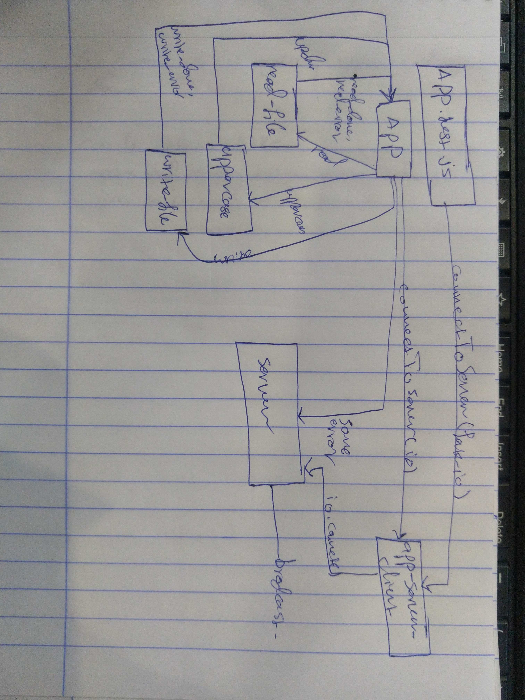

# LAB - Class 18

### Author: Ibrahim

### Links and Resources

- [submission PR](https://github.com/401-advanced-javascript-qusaiAlhanaktah/lab-18/pull/1)
- [ci/cd](https://github.com/401-advanced-javascript-ibrahim/lab18/actions)

### Setup
npm i jest eslint

#### How to initialize/run your application (where applicable)

- `npm test`

#### Tests

- How do you run tests?
     - 'npm test'

#### UML
